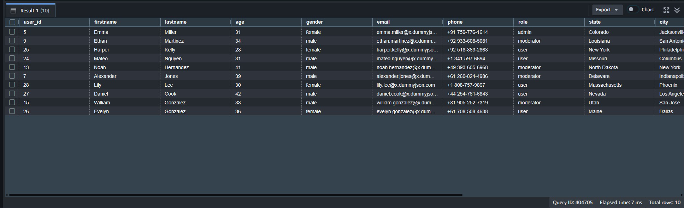
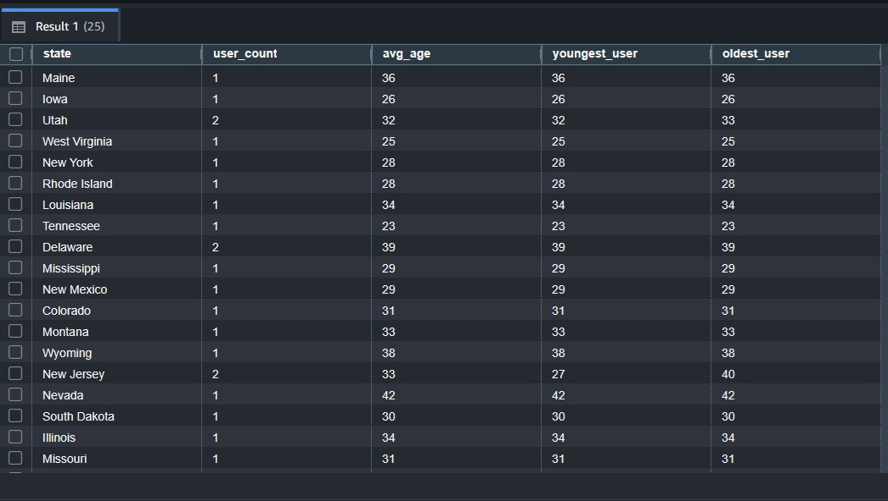

# MWAA Orchestrated AWS ELT Pipeline – S3 + Redshift Serverless

## Overview

This project implements an end-to-end ELT pipeline on AWS using S3 and Redshift Serverless, and orchestrated by Airflow (MWAA).

Data is ingested from a public API, stored in an S3-based bronze layer, transformed into structured warehouse tables using Redshift, and aggregated into analytical gold-layer tables.

The pipeline demonstrates incremental ingestion, idempotent upserts, layered data modeling, and cloud-native warehouse design.

## Architecture
DummyJSON API
↓
Python Ingestion (boto3 + requests)
↓
S3 Bronze (append-only, partitioned by ingestion_date)
↓
Redshift Bronze (raw structured load)
↓
Redshift Silver (MERGE + deduplication)
↓
Redshift Gold (aggregated analytical tables)

## Technologies Used
- Apache Airflow (MWAA)
- AWS S3
- AWS Redshift Serverless
- AWS IAM
- Python (boto3, requests)
- SQL (Redshift)

## Medallion Architecture 
### Bronze Layer
- Append-only ingestion
- JSON stored in S3
- Loaded into Redshift using COPY
- Includes ingestion metadata (date and timestamp)
- Nested fields stored as SUPER

### Silver Layer
- Flattened structured schema
- Deduplicated using: ROW_NUMBER() OVER (PARTITION BY id ORDER BY ingestion_timestamp DESC)
- Incremental upserts using MERGE
- Latest-record-wins logic

### Gold Layer
- Aggregated analytical tables:
  - Users by state
  - Users by department
  - Users by role

